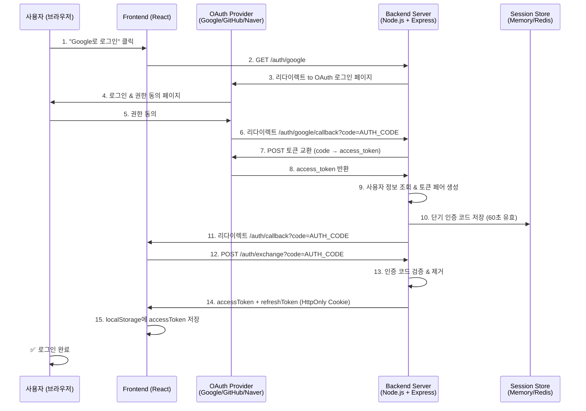
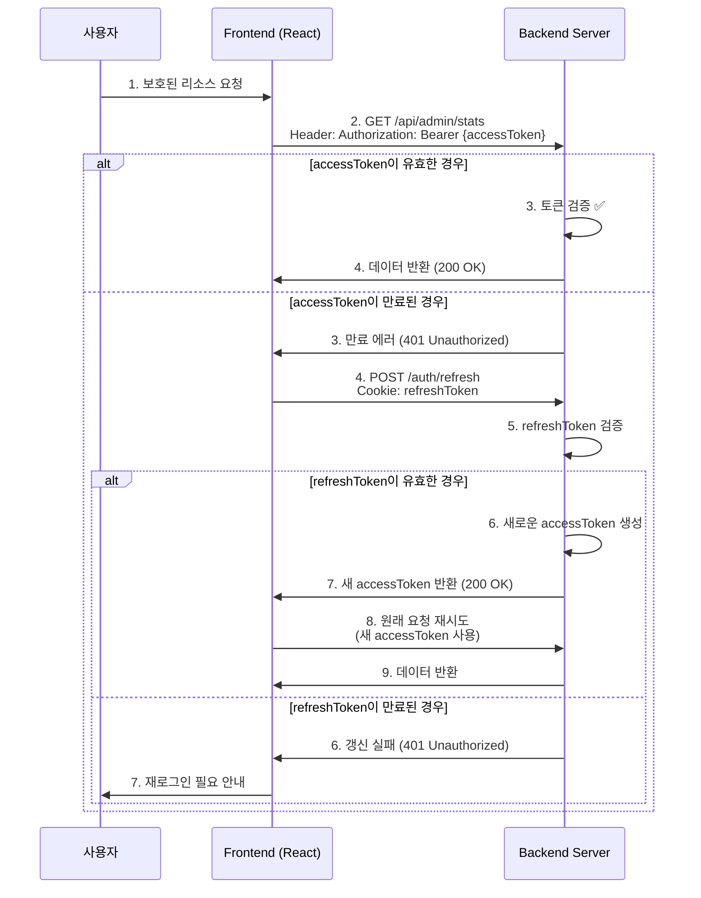

# FreeLang Light Architecture & Security

## 🏗️ System Architecture

### OAuth 2.0 Complete Flow



### Token Refresh Flow



### Security Layer Architecture

```
┌─────────────────────────────────────────────────────────────────┐
│                      External Requests                          │
└────────────────────────┬────────────────────────────────────────┘
                         │
┌────────────────────────▼────────────────────────────────────────┐
│  Layer 1: Security Headers (helmet)                             │
│  ├─ HSTS (HTTP Strict Transport Security)                       │
│  ├─ X-Frame-Options (Clickjacking Protection)                   │
│  ├─ X-Content-Type-Options (MIME Sniffing Prevention)           │
│  └─ Content-Security-Policy (XSS Prevention)                    │
└────────────────────────┬────────────────────────────────────────┘
                         │
┌────────────────────────▼────────────────────────────────────────┐
│  Layer 2: CORS & Rate Limiting                                  │
│  ├─ CORS: credentials + origin validation                       │
│  ├─ Auth Rate Limit: 10 requests/15min                          │
│  └─ API Rate Limit: 100 requests/min                            │
└────────────────────────┬────────────────────────────────────────┘
                         │
┌────────────────────────▼────────────────────────────────────────┐
│  Layer 3: Input Validation (Joi)                                │
│  ├─ Query Parameters: code (alphanum, 10-500 chars)             │
│  ├─ Body Parameters: title, content validation                  │
│  └─ Auto-cleanup: stripUnknown=true                             │
└────────────────────────┬────────────────────────────────────────┘
                         │
┌────────────────────────▼────────────────────────────────────────┐
│  Layer 4: Authentication (JWT)                                  │
│  ├─ Access Token: 15 minutes (Authorization header)             │
│  ├─ Refresh Token: 30 days (HttpOnly cookie)                    │
│  ├─ Token Type: access/refresh (type field)                     │
│  └─ Secret Validation: Throws error if not set                  │
└────────────────────────┬────────────────────────────────────────┘
                         │
┌────────────────────────▼────────────────────────────────────────┐
│  Layer 5: Business Logic                                        │
│  ├─ Single-use Auth Code (60sec expiry)                         │
│  ├─ Session Management (7 days)                                 │
│  └─ Route Handlers                                              │
└────────────────────────┬────────────────────────────────────────┘
                         │
┌────────────────────────▼────────────────────────────────────────┐
│  Layer 6: Response Security                                     │
│  ├─ No sensitive data in responses                              │
│  ├─ No JWT in URL query parameters                              │
│  ├─ Timestamp for replay attack prevention                      │
│  └─ Error messages without stack traces                         │
└────────────────────────┬────────────────────────────────────────┘
                         │
┌────────────────────────▼────────────────────────────────────────┐
│                    Database / Storage                            │
│              (PostgreSQL / Redis / Memory)                       │
└─────────────────────────────────────────────────────────────────┘
```

## 🔐 Security Improvements (Phase 1-3)

### Phase 1: Security Foundation
- ✅ Helmet middleware for security headers
- ✅ Express rate limiting (Auth: 10/15min, API: 100/min)
- ✅ Cookie parser for HttpOnly cookie handling
- ✅ JWT_SECRET validation (throws error if not set)

### Phase 2: JWT Enhancement
- ✅ Token pair generation (Access + Refresh)
- ✅ Access token: 15 minutes (for sensitive operations)
- ✅ Refresh token: 30 days (stored in HttpOnly cookie)
- ✅ Single-use auth code (60 seconds)
- ✅ Removed JWT exposure from URL (was: `?token=...&user=...`)
- ✅ New endpoints: `/auth/exchange` and `/auth/refresh`

### Phase 3: Input Validation
- ✅ Joi schema validation for all inputs
- ✅ OAuth callback code validation (alphanum, 10-500)
- ✅ Post creation validation (title, content constraints)
- ✅ Auto-cleanup of unknown fields (stripUnknown)

## 📊 Testing Infrastructure (Phase 4)

### Jest Configuration
```typescript
// jest.config.ts
roots: ['<rootDir>/tests', '<rootDir>/src']
coverageThreshold: {
  global: {
    branches: 60,
    functions: 70,
    lines: 70,
    statements: 70
  }
}
```

### Test Scripts
```bash
# Run all tests
npm test

# Run auth-specific tests
npm run test:auth

# Generate coverage report
npm run coverage

# CI coverage upload format
npm run coverage:ci
```

### OAuth Token Tests
- ✅ Token generation with valid JWT structure
- ✅ Token verification success/failure cases
- ✅ Token expiration handling
- ✅ Token pair generation (access + refresh)
- ✅ Refresh token validation
- ✅ Access token rejection when used as refresh token

## 📚 API Documentation (Phase 5)

### Swagger UI
- Endpoint: `/api/docs`
- Spec Format: OpenAPI 3.0.0
- Auto-refresh: Reloads from `docs/api.yaml`

### Documented Endpoints
- POST `/auth/exchange` — Code to token exchange
- POST `/auth/refresh` — Refresh token to new access token
- GET `/api/health` — Health check
- GET `/api/admin/stats` — Dashboard statistics
- POST `/api/admin/posts` — Create post (with Joi validation)

## 🛠️ Environment Variables

```bash
# Security
JWT_SECRET=your-strong-random-secret-change-this
JWT_REFRESH_SECRET=your-strong-random-refresh-secret
SESSION_SECRET=your-session-secret

# Server
NODE_ENV=production
SERVER_PORT=3001
BASE_URL=https://253.dclub.kr
FRONTEND_URL=https://253.dclub.kr

# OAuth Providers
GOOGLE_CLIENT_ID=...
GOOGLE_CLIENT_SECRET=...
GITHUB_CLIENT_ID=...
GITHUB_CLIENT_SECRET=...
NAVER_CLIENT_ID=...
NAVER_CLIENT_SECRET=...
```

## 🔍 Validation Rules

### OAuth Code Validation
```
- Type: Alphanumeric only
- Min length: 10 characters
- Max length: 500 characters
- Auto-cleanup: Unknown fields stripped
```

### Post Creation Validation
```
- Title:
  - Min length: 1 character
  - Max length: 200 characters
  - Required: true
- Content:
  - Min length: 1 character
  - Max length: 50,000 characters
  - Required: true
```

## ⚡ Performance & Limits

| Component | Limit | Duration |
|-----------|-------|----------|
| Auth Rate Limit | 10 requests | 15 minutes |
| API Rate Limit | 100 requests | 1 minute |
| Access Token | - | 15 minutes |
| Refresh Token | - | 30 days |
| Auth Code | - | 60 seconds |
| Session | - | 7 days |

## 📋 Deployment Checklist

- [ ] All environment variables set (.env file)
- [ ] JWT_SECRET and JWT_REFRESH_SECRET are strong random values
- [ ] SSL/HTTPS enabled in production
- [ ] CORS origin restricted to frontend domain
- [ ] Rate limiting active
- [ ] Helmet security headers enabled
- [ ] Swagger UI accessible at /api/docs
- [ ] Health check endpoint working
- [ ] Tests passing with >70% coverage
- [ ] OAuth providers configured with correct callback URLs

---

**Last Updated**: 2026-03-14
**Phase**: 1-5 Complete (Security → JWT → Validation → Testing → Documentation)
